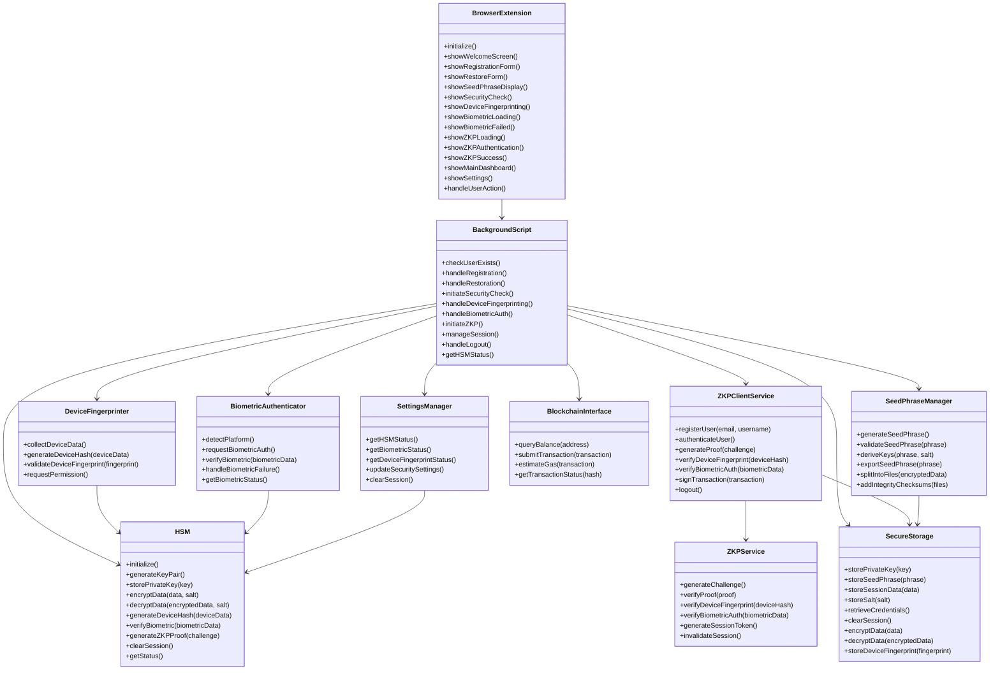
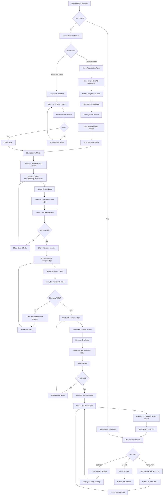
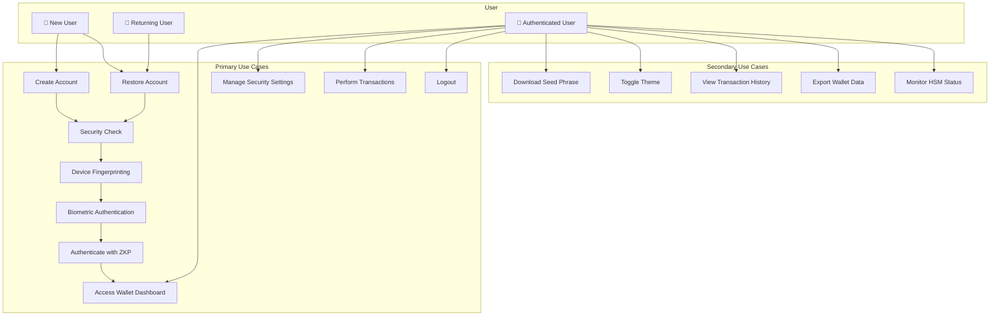
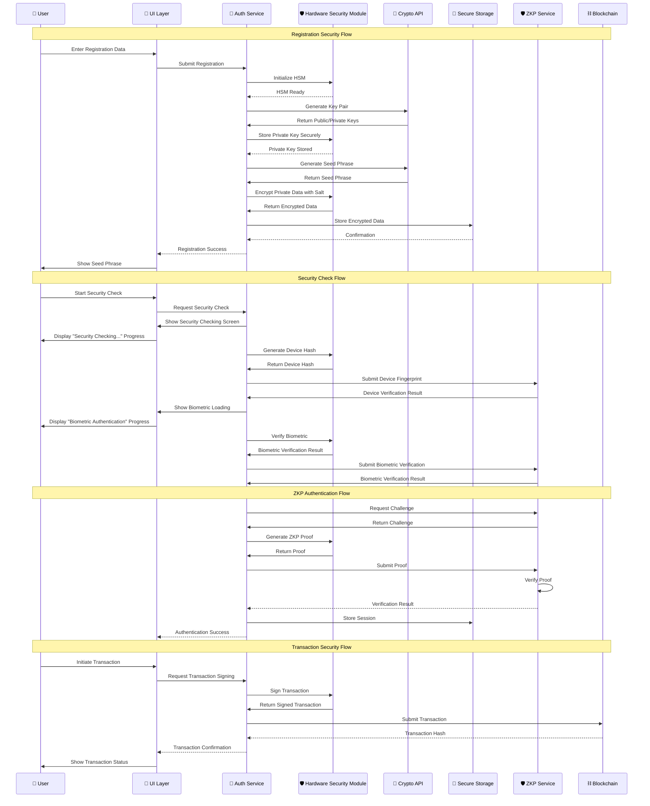
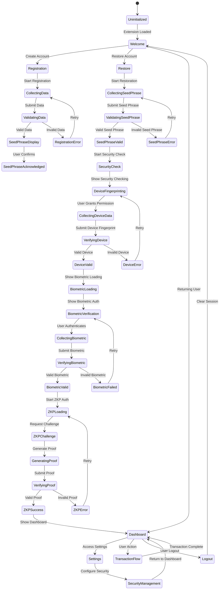
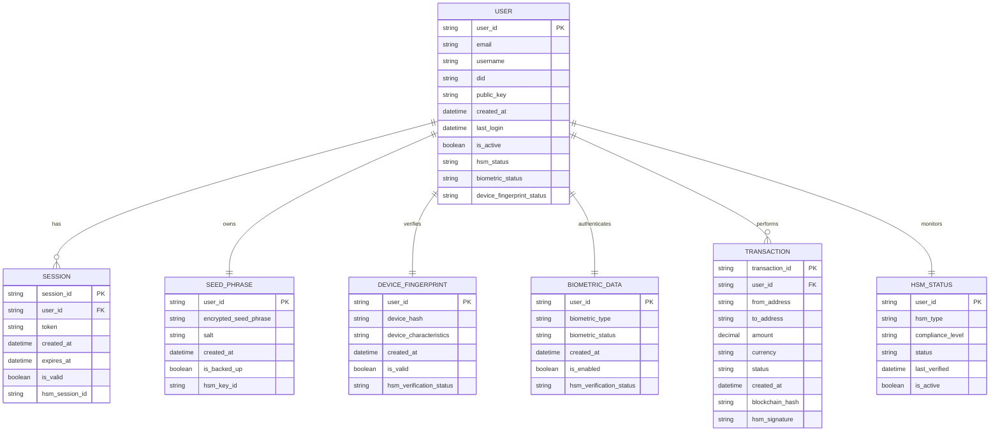
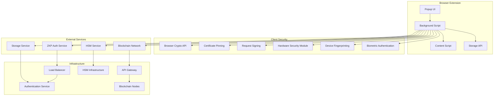

# MirrorStack Wallet - UML Diagrams

## 🏗️ Class Diagram

## 🔄 Activity Diagram - Complete User Journey

## 🎯 Use Case Diagram

## 🔐 Security Sequence Diagram

## 📊 Component Diagram

```mermaid
graph TB
    subgraph "Frontend Components"
        A[Welcome Component]
        B[Registration Component]
        C[Restore Component]
        D[Seed Phrase Component]
        E[Security Check Component]
        F[Device Fingerprinting Component]
        G[Biometric Loading Component]
        H[Biometric Failed Component]
        I[ZKP Loading Component]
        J[Authentication Component]
        K[Main Dashboard Component]
        L[Settings Component]
        M[Transaction Component]
    end
    
    subgraph "Service Layer"
        N[Auth Service]
        O[ZKP Service]
        P[Storage Service]
        Q[Crypto Service]
        R[Blockchain Service]
        S[HSM Service]
    end
    
    subgraph "Security Layer"
        T[Certificate Pinning]
        U[Request Signing]
        V[Rate Limiting]
        W[Audit Logging]
        X[Device Fingerprinting]
        Y[Biometric Authentication]
    end
    
    subgraph "External Services"
        Z[ZKP Auth Service]
        AA[Blockchain Network]
        BB[Storage API]
        CC[Hardware Security Module]
    end
    
    A --> N
    B --> N
    C --> N
    D --> P
    E --> S
    F --> S
    G --> S
    H --> S
    I --> O
    J --> O
    K --> R
    L --> S
    M --> R
    
    N --> Q
    O --> Q
    P --> Q
    S --> Q
    
    N --> T
    N --> U
    N --> V
    N --> W
    N --> X
    N --> Y
    
    O --> Z
    R --> AA
    P --> BB
    S --> CC
```

## 🔄 State Transition Diagram

## 📋 Entity Relationship Diagram

## 🔧 Deployment Diagram

These UML diagrams provide a comprehensive view of the MirrorStack Wallet system architecture, covering all aspects from user interactions to security implementations and deployment considerations, now including the enhanced HSM integration, biometric authentication, device fingerprinting, and comprehensive security management features. 
These UML diagrams provide a comprehensive view of the MirrorStack Wallet system architecture, covering all aspects from user interactions to security implementations and deployment considerations. 
These UML diagrams provide a comprehensive view of the MirrorStack Wallet system architecture, covering all aspects from user interactions to security implementations and deployment considerations. 