# MirrorStack Wallet - User Stories & Flow Diagrams

## 🎯 User Stories Overview

Based on the Figma UI screens analysis, here are the comprehensive user stories for MirrorStack Wallet:

### **User Story 1: Welcome & Onboarding**
**As a** new user  
**I want to** access the MirrorStack Wallet  
**So that** I can create a new account or restore an existing one

**Acceptance Criteria:**
- User sees welcome screen with MirrorStack logo
- Two clear options: "Create an Account" and "Restore your Account"
- Theme toggle available in top-right corner
- Clean, intuitive interface with clear descriptions

### **User Story 2: Account Creation**
**As a** new user  
**I want to** create a new wallet account  
**So that** I can securely store and manage my digital assets

**Acceptance Criteria:**
- User enters email and username
- System generates 12-word seed phrase
- User must acknowledge and store seed phrase securely
- Salt field is optional for additional security
- Download option for seed phrase backup

### **User Story 3: Account Restoration**
**As a** returning user  
**I want to** restore my wallet using my seed phrase  
**So that** I can access my existing account and funds

**Acceptance Criteria:**
- User enters 12-word seed phrase with spaces
- Optional salt field for additional security
- System validates seed phrase format
- Error handling for invalid seed phrases

### **User Story 4: Behavioral Verification**
**As a** user  
**I want to** verify my humanity through signature  
**So that** I can prove I'm a real person

**Acceptance Criteria:**
- User sees random number to sign
- Drawing canvas for signature input
- Clear instructions for signature creation
- Validation of signature pattern

### **User Story 5: Biometric Authentication**
**As a** user  
**I want to** authenticate using biometrics (Apple Key/Windows Hello)  
**So that** I can securely access my wallet with device-level security

**Acceptance Criteria:**
- System requests biometric authentication
- Integration with Apple Key (macOS) or Windows Hello (Windows)
- Secure biometric verification process
- Fallback options if biometric fails

### **User Story 6: ZKP Authentication**
**As a** user  
**I want to** authenticate using zero-knowledge proofs  
**So that** I can securely access my wallet without revealing private keys

**Acceptance Criteria:**
- User sees authentication loading screen
- Clear indication of source and destination URLs
- ZKP challenge-response protocol
- Success/failure feedback

### **User Story 7: Wallet Dashboard**
**As a** authenticated user  
**I want to** view my wallet dashboard  
**So that** I can see my account information and access features

**Acceptance Criteria:**
- Display user email and username
- Educational content about MirrorStack Wallet
- Theme toggle functionality
- Clean, organized layout

---

## 🔄 Complete User Flow Sequence Diagram

```mermaid
sequenceDiagram
    participant User as 👤 User
    participant Extension as 🧩 Browser Extension
    participant Background as 🔧 Background Script
    participant ZKPClient as 🔑 ZKP Client Service
    participant ZKPService as 🛡️ ZKP Auth Service
    participant Storage as 💾 Secure Storage
    participant Blockchain as ⛓️ Blockchain Network

    Note over User, Blockchain: Welcome & Onboarding Flow
    User->>Extension: Open Extension Popup
    Extension->>Background: Check if user exists
    Background->>Storage: Query stored credentials
    
    alt First Time User (No stored credentials)
        Storage-->>Background: No credentials found
        Background-->>Extension: Show welcome screen
        Extension->>User: Display welcome UI with options
        User->>Extension: Choose "Create Account" or "Restore Account"
        
        alt Create New Account
            Extension->>User: Show registration form
            User->>Extension: Enter email & username
            Extension->>Background: Submit registration data
            Background->>ZKPClient: Register new user
            ZKPClient->>ZKPService: POST /api/v1/auth/register
            ZKPService->>ZKPService: Generate DID, keypair & seed phrase
            ZKPService-->>ZKPClient: Return DID, public_key, private_key, seed phrase
            ZKPClient-->>Background: Registration successful
            Background->>Storage: Securely store private key, seed phrase, email & username
            Storage-->>Background: Data stored successfully
            Background-->>Extension: Show seed phrase screen
            Extension->>User: Display 12-word seed phrase with download option
            User->>Extension: Choose download option
            Extension->>Background: Generate 4 random files
            Background->>Background: Split seed phrase into 4 groups
            Background->>Background: Randomly shuffle each group
            Background-->>Extension: Return 4 download files
            Extension->>User: Download 4 separate files
            User->>Extension: Input optional salt
            User->>Extension: Acknowledge seed phrase storage
            Extension->>Background: Confirm seed phrase acknowledgment with salt
            Background->>Storage: Encrypt and store seed phrase with salt
            Storage-->>Background: Data stored successfully
            Background-->>Extension: Proceed to authentication
        else Restore Existing Account
            Extension->>User: Show restore form
            User->>Extension: Enter 12-word seed phrase & optional salt
            Extension->>Background: Submit restoration data
            Background->>ZKPClient: Validate seed phrase
            ZKPClient->>ZKPClient: Derive keys from seed phrase
            ZKPClient-->>Background: Restoration successful
            Background->>Storage: Store derived keys and user data
            Storage-->>Background: Data stored successfully
            Background-->>Extension: Proceed to authentication
        end
    else Returning User (Credentials exist)
        Storage-->>Background: Credentials found
        Background-->>Extension: Show main dashboard
        Extension->>User: Display wallet dashboard
    end

    Note over User, Blockchain: Authentication Flow (Behavioral → Biometric → ZKP)
    Background->>Extension: Show behavioral verification
    Extension->>User: Display signature verification screen
    User->>Extension: Sign the displayed number
    Extension->>Background: Submit signature for verification
    Background->>ZKPClient: Verify behavioral signature
    ZKPClient->>ZKPService: POST /api/v1/auth/behavioral-verify
    ZKPService-->>ZKPClient: Behavioral verification result
    alt Behavioral Verification Success
        ZKPClient-->>Background: Behavioral verification successful
        Background-->>Extension: Show biometric authentication
        Extension->>User: Request biometric authentication (Apple Key/Windows Hello)
        User->>Extension: Complete biometric authentication
        Extension->>Background: Submit biometric verification
        Background->>ZKPClient: Verify biometric authentication
        ZKPClient->>ZKPService: POST /api/v1/auth/biometric-verify
        ZKPService-->>ZKPClient: Biometric verification result
        alt Biometric Verification Success
            ZKPClient-->>Background: Biometric verification successful
            Background->>ZKPClient: Initiate ZKP authentication
            ZKPClient->>ZKPService: POST /api/v1/auth/challenge
            ZKPService->>ZKPService: Generate challenge (p, g, challenge)
            ZKPService-->>ZKPClient: Return challenge data
            ZKPClient->>ZKPClient: Generate ZKP proof
            Note right of ZKPClient: Chaum-Pedersen Protocol:<br/>1. Generate random r<br/>2. Calculate commitment: t = g^r mod p<br/>3. Calculate response: s = r + challenge * private_key mod (p-1)
            ZKPClient->>ZKPService: POST /api/v1/auth/verify
            ZKPService->>ZKPService: Verify ZKP proof
            alt ZKP Proof Valid
                ZKPService->>ZKPService: Generate session token
                ZKPService-->>ZKPClient: Return session_id & token
                ZKPClient-->>Background: ZKP authentication successful
                Background->>Storage: Store session data
                Background-->>Extension: Update UI to authenticated state
                Extension->>User: Show main wallet dashboard
            else ZKP Proof Invalid
                ZKPService-->>ZKPClient: ZKP authentication failed
                ZKPClient-->>Background: ZKP authentication failed
                Background-->>Extension: Show error message
                Extension->>User: Display ZKP authentication error
            end
        else Biometric Verification Failed
            ZKPService-->>ZKPClient: Biometric verification failed
            ZKPClient-->>Background: Biometric verification failed
            Background-->>Extension: Show error message
            Extension->>User: Display biometric authentication error
        end
    else Behavioral Verification Failed
        ZKPService-->>ZKPClient: Behavioral verification failed
        ZKPClient-->>Background: Behavioral verification failed
        Background-->>Extension: Show error message
        Extension->>User: Display behavioral verification error
    end

    Note over User, Blockchain: Main Wallet Dashboard
    User->>Extension: Access wallet features
    Extension->>Background: Request user data
    Background->>Storage: Retrieve stored email and username
    Storage-->>Background: Return user data
    Background->>ZKPClient: Get session info
    ZKPClient->>ZKPService: GET /api/v1/auth/session
    ZKPService-->>ZKPClient: Return session status
    ZKPClient-->>Background: Session valid
    Background-->>Extension: Update wallet UI
    Extension->>User: Display user information (email, username)



    Note over User, Blockchain: Logout Flow
    User->>Extension: Request logout
    Extension->>Background: Show backup warning
    Background-->>Extension: Display backup confirmation dialog
    Extension->>User: Show backup warning dialog
    User->>Extension: Confirm backup or proceed anyway
    Extension->>Background: Handle backup confirmation
    Background->>ZKPClient: Logout session
    ZKPClient->>ZKPService: POST /api/v1/auth/logout
    ZKPService->>ZKPService: Invalidate session
    ZKPService-->>ZKPClient: Logout successful
    ZKPClient-->>Background: Session cleared
    Background->>Storage: Clear session data
    Background-->>Extension: Reset to welcome state
    Extension->>User: Show welcome screen
```

## 🏗️ UI State Machine

## 🎨 UI Component Architecture

## 🔐 Security Flow Details

### 1. **Seed Phrase Generation & Storage**

### 2. **ZKP Proof Generation**

### 3. **Behavioral Verification Flow**

### 4. **Biometric Authentication Flow**

## 📱 UI/UX Flow Details

### **Welcome Screen Flow**
1. **Logo Display**: MirrorStack logo prominently displayed
2. **Two Main Options**: 
   - "Create an Account" (primary action)
   - "Restore your Account" (secondary action)
3. **Clear Descriptions**: Each option has explanatory text
4. **Theme Toggle**: Available in top-right corner

### **Registration Flow**
1. **Email & Username Input**: Clean form with validation
2. **Seed Phrase Generation**: System generates 12-word phrase
3. **Seed Phrase Display**: 
   - 12 words in numbered boxes
   - Download option for backup (4 separate files)
   - Warning about secure storage
4. **Salt Input**: User can input optional salt for additional encryption
   - Salt field is optional (can be left empty)
   - Combines with seed phrase for enhanced security
   - Creates unique key derivation path
5. **Confirmation**: User must acknowledge storage
6. **Encryption**: Seed phrase encrypted with salt before storage

### **Restore Flow**
1. **Seed Phrase Input**: Large text area for 12 words
2. **Salt Field**: Optional field for additional security
   - **Purpose**: Adds an extra layer of security to seed phrase derivation
   - **How it works**: Combines with seed phrase to create unique key derivation path
   - **User choice**: Can be left empty for standard BIP39 derivation
   - **Security benefit**: Even if seed phrase is compromised, salt provides additional protection
   - **Storage**: Salt is stored locally and never transmitted to servers
3. **Validation**: Real-time validation of seed phrase format
4. **Error Handling**: Clear error messages for invalid input

### **Behavioral Verification Flow**
1. **Number Display**: Random number prominently shown
2. **Signature Canvas**: Drawing area with clear instructions
3. **Pattern Recognition**: System analyzes signature characteristics
4. **Validation**: Ensures human-like drawing patterns

### **Biometric Authentication Flow**
1. **Platform Detection**: Automatically detect OS (macOS/Windows)
2. **Authentication Request**: System prompts for biometric authentication
3. **Device Integration**: Seamless integration with Apple Key/Windows Hello
4. **Fallback Options**: Alternative authentication if biometric fails

### **ZKP Authentication Flow**
1. **Loading Screen**: Progress indicator with source/destination URLs
2. **Authentication Screen**: Clear authorization request
3. **Success Screen**: Confirmation with checkmark icon
4. **Error Handling**: Clear error messages for failed authentication

### **Seed Phrase Download System**
1. **4-File Split**: Seed phrase divided into 4 groups of 3 words each
2. **Random Shuffling**: Each group is randomly shuffled for security
3. **Separate Downloads**: Each group downloaded as a separate file
4. **Security Benefits**: 
   - Reduces risk of complete compromise
   - Requires multiple files to reconstruct seed phrase
   - Allows distributed storage across different locations
5. **File Naming**: Clear naming convention (e.g., "seed_part_1.txt")

### **Main Dashboard Flow**
1. **User Information**: Display email and username
2. **Educational Content**: Information about MirrorStack Wallet
3. **Theme Toggle**: Consistent theme switching
4. **Clean Layout**: Organized information display

## 🔒 Security Considerations

### **Key Security Features**
- **Zero-Knowledge Proofs**: Never reveal private keys
- **Seed Phrase Security**: 12-word BIP39 standard
- **Browser Crypto API**: Secure key storage and operations
- **Certificate Pinning**: Prevent MITM attacks
- **Behavioral Verification**: Human verification through signature
- **Session Management**: Secure token handling
- **Salt Addition**: Optional additional security layer

### **Privacy Features**
- **Local Storage**: Sensitive data stays on device
- **No Tracking**: No user behavior tracking
- **GDPR Compliant**: Minimal data collection
- **Anonymous Transactions**: ZKP enables privacy

## 📱 UI/UX Considerations

### **Design System**
- **Color Scheme**: Blue primary (#236488), light background (#f6fafe)
- **Typography**: Shantell Sans font family
- **Icons**: Material Design icons for consistency
- **Spacing**: Consistent padding and margins
- **Corner Radius**: 24px for main containers, 16px for buttons

### **Accessibility**
- **WCAG 2.1 Compliant**: Proper contrast ratios
- **Keyboard Navigation**: Full keyboard accessibility
- **Screen Reader Support**: Proper ARIA labels
- **Error Handling**: Clear, helpful error messages
- **Loading States**: Progress indicators for all async operations

### **User Experience**
- **Progressive Disclosure**: Information revealed as needed
- **Clear Feedback**: Immediate response to user actions
- **Error Recovery**: Easy ways to correct mistakes
- **Consistent Navigation**: Predictable user flow
- **Mobile Responsive**: Works on all screen sizes

This comprehensive user stories and flow diagrams document provides a complete blueprint for implementing the MirrorStack Wallet browser extension with secure, user-friendly authentication using zero-knowledge proofs and behavioral verification. 